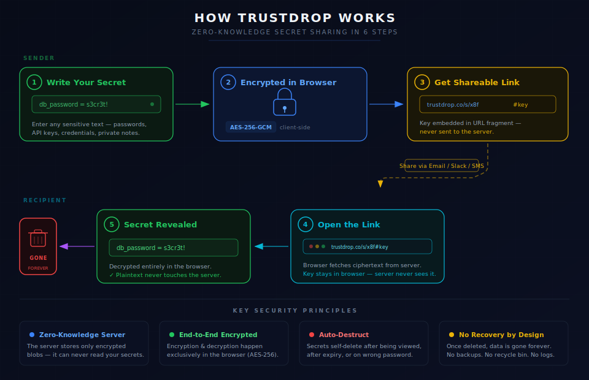

<p align="center">
  
</p>

<h1 align="center">TrustDrop</h1>

<p align="center">
  <strong>Zero-knowledge, one-time secret sharing</strong><br />
  Encrypt messages and files in your browser. Share a secure link with configurable burn rules. Secrets are destroyed after your conditions are met.
</p>

<p align="center">
  <a href="https://www.trustdrop.com">Live App</a> &middot;
  <a href="https://www.trustdrop.com/blog">Blog</a> &middot;
  <a href="https://www.trustdrop.com/how-it-works">How It Works</a>
</p>

---

## What is TrustDrop?

TrustDrop lets you share sensitive information — passwords, API keys, credentials, private messages, or files up to 50 MB — without ever trusting the server.

Everything is encrypted in your browser using **AES-256-GCM** before it leaves your device. The server only ever sees ciphertext. When the recipient opens the link and decrypts the content, the ciphertext is permanently destroyed. No accounts required. No logs. No trust needed.

## How It Works

<p align="center">
  
</p>

## Key Features

- **Zero-knowledge encryption** — AES-256-GCM encryption happens entirely in the browser via the WebCrypto API. The server never has access to your encryption keys or plaintext data.
- **Configurable destruction** — Set secrets to self-destruct after a single view, up to 50 views, a time limit (1 hour to 30 days), or a wrong password attempt.
- **File support** — Upload and encrypt files up to 50 MB, not just text.
- **Password protection** — Optionally require a password using PBKDF2 with 310,000 iterations for key derivation.
- **No accounts** — No sign-up, no login, completely anonymous.
- **Embeddable widget** — Add TrustDrop to your own site with a single `<script>` tag.

## Security Model

TrustDrop is designed so that even a compromised server cannot read your secrets.

| Layer | Implementation |
|-------|---------------|
| **Encryption** | AES-256-GCM via WebCrypto API |
| **Key derivation (password mode)** | PBKDF2 SHA-256, 310,000 iterations, random 16-byte salt |
| **Drop IDs** | 128-bit entropy (22-char base64url), brute-force infeasible |
| **Access tokens** | Separate 128-bit token per drop, required for all operations |
| **URL structure** | `/d/{id}?t={accessToken}#k={encryptionKey}` — key in fragment, never sent to server |
| **Existence leakage** | Uniform 404 for invalid tokens and non-existent drops |
| **Referrer protection** | `no-referrer` policy prevents token leakage via HTTP headers |
| **Rate limiting** | Per-IP tiered limits on all API endpoints |

### Encryption Modes

- **Mode A (no password):** A random 256-bit key is generated and placed in the URL fragment (`#k=base64url(key)`). The fragment is never sent to the server — only the recipient's browser can read it.
- **Mode B (password):** The encryption key is derived from the recipient's password using PBKDF2 with SHA-256 and 310,000 iterations. A random 16-byte salt is stored alongside the ciphertext.

### Two-Step Consume Flow

To prevent counting failed decryption attempts as views:

1. Client fetches ciphertext via `/consume` (view count not incremented)
2. Client decrypts locally in the browser
3. On success: client calls `/confirm` to increment the view count
4. On failure with burn-on-fail enabled: client calls `/burn` to destroy the drop

## Tech Stack

| Component | Technology |
|-----------|-----------|
| Frontend | React, Vite, Tailwind CSS, Shadcn UI |
| Backend | Express.js, Node.js |
| Database | PostgreSQL |
| Encryption | WebCrypto API (AES-256-GCM, PBKDF2) |
| Routing | wouter |
| Admin auth | bcryptjs + TOTP (Google Authenticator compatible) |
| Blog | Markdown rendering with marked |

## Project Structure

```
trustdrop/
├── client/                  # React frontend
│   ├── src/
│   │   ├── pages/           # Route pages (home, retrieve, admin, blog, etc.)
│   │   ├── components/      # Shared components (layout, page-meta, ui/)
│   │   ├── lib/             # Crypto utilities, query client
│   │   └── hooks/           # Custom React hooks
│   └── public/              # Static assets, widget.js
├── server/                  # Express backend
│   ├── routes.ts            # API endpoints
│   ├── storage.ts           # PostgreSQL storage layer
│   └── index.ts             # Server entry point
├── shared/                  # Shared types and schemas
│   └── schema.ts            # Drizzle ORM schema + Zod validation
└── README.md
```

## API Reference

### Drop Endpoints

All endpoints (except create) require an access token via `?t={accessToken}`.

| Method | Endpoint | Description |
|--------|----------|-------------|
| `POST` | `/api/drops` | Create a new encrypted drop |
| `GET` | `/api/drops/:id/meta?t={token}` | Check if drop exists, get metadata |
| `POST` | `/api/drops/:id/consume?t={token}` | Fetch ciphertext (no view count) |
| `POST` | `/api/drops/:id/confirm?t={token}` | Confirm successful decryption |
| `POST` | `/api/drops/:id/burn?t={token}` | Destroy drop (wrong password) |

### Admin Endpoints

| Method | Endpoint | Description |
|--------|----------|-------------|
| `GET` | `/api/admin/status` | Check if admin is configured |
| `POST` | `/api/admin/setup` | Initial setup (password + TOTP) |
| `POST` | `/api/admin/login` | Authenticate with password + TOTP |
| `GET` | `/api/admin/session` | Check current session status |
| `POST` | `/api/admin/logout` | Destroy admin session |

### Blog Endpoints

| Method | Endpoint | Description |
|--------|----------|-------------|
| `GET` | `/api/blog` | List published posts |
| `GET` | `/api/blog/:slug` | Get published post by slug |
| `GET` | `/blog/feed.xml` | RSS feed |
| `POST` | `/api/admin/blog` | Create post (admin) |
| `PATCH` | `/api/admin/blog/:id` | Update post (admin) |
| `DELETE` | `/api/admin/blog/:id` | Delete post (admin) |

### Rate Limits

All limits are per-IP address with a 15-minute window:

| Endpoint | Limit | Purpose |
|----------|-------|---------|
| Drop creation | 50 / 15 min | Prevent storage abuse |
| Drop retrieval | 150 / 15 min | General usage |
| Admin login | 25 / 15 min | Brute-force prevention |
| All API routes | 500 / 15 min | Catch-all safety net |

> **Privacy note:** IP addresses used for rate limiting are held in server memory only. They are never written to disk, logged, or stored in the database. All rate limit counters are automatically purged when the 15-minute window resets, and all data is lost on server restart. No IP address is ever persisted or trackable.

## Embeddable Widget

Add TrustDrop to any website with a single script tag:

```html
<div id="trustdrop-widget"
     data-instance="https://www.trustdrop.com"
     data-theme="dark"
     data-accent="#2b7a8c">
</div>
<script src="https://www.trustdrop.com/widget.js"></script>
```

The widget runs in a Shadow DOM for complete style isolation and includes its own AES-256-GCM encryption — no dependencies required.

## Contributing

We welcome contributions! Whether it's bug fixes, feature improvements, or documentation updates, feel free to open an issue or submit a pull request.

1. Fork the repository
2. Create your feature branch (`git checkout -b feature/your-feature`)
3. Commit your changes (`git commit -m 'Add your feature'`)
4. Push to the branch (`git push origin feature/your-feature`)
5. Open a Pull Request

## Roadmap

- [ ] Browser extension (Chrome + Firefox) for right-click encrypt and share
- [ ] Multi-tenant white-label support with custom branding
- [ ] Self-hosting guide with Docker
- [ ] Larger file uploads (500 MB - 1 GB)

## License

AGPL-3.0 — see [LICENSE](LICENSE) for details.

---

<p align="center">
  Built with privacy in mind. Your secrets are yours alone.
</p>
